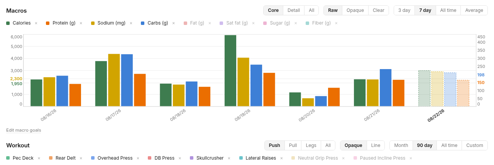
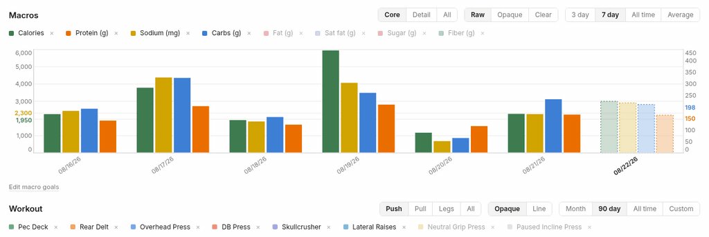
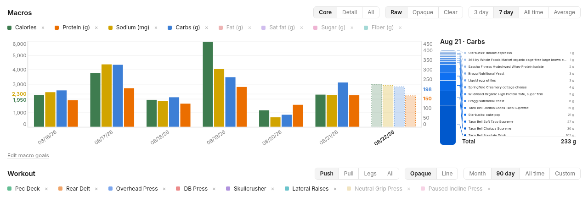
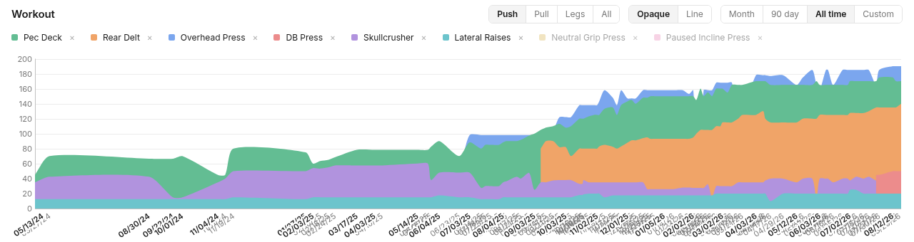

# cbum chart (health track)

The same chart as main, plus the Apple Health stack on top: an iOS Shortcut
posts phone, watch, and scale samples to the worker, they land in a D1
database, and a second chart page at `/health` shows sleep by stage, steps,
heart, and body composition.

| Day blow-up | Workout progress |
|---|---|
|  |  |

Setup, health steps included: [docs/setup.md](docs/setup.md). The first
real ingest run: [docs/first-run-readout.md](docs/first-run-readout.md).
The contract the agent logs under: [FORMATTING.md](FORMATTING.md).

More: [technical reference](docs/technical.md) -
[data model](docs/data-model.md) - [design notes](docs/design.md) -
[running it as an agent](docs/agent-ops.md).

This branch exists as an open PR against main: the Apple Health stack is an
optional add-on, so main stays the food + workout tracker that any fork
gets by default. The owner's production deployment follows this branch.
