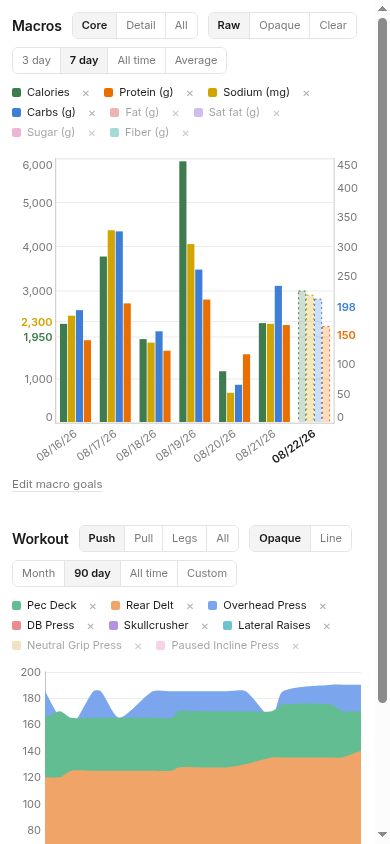
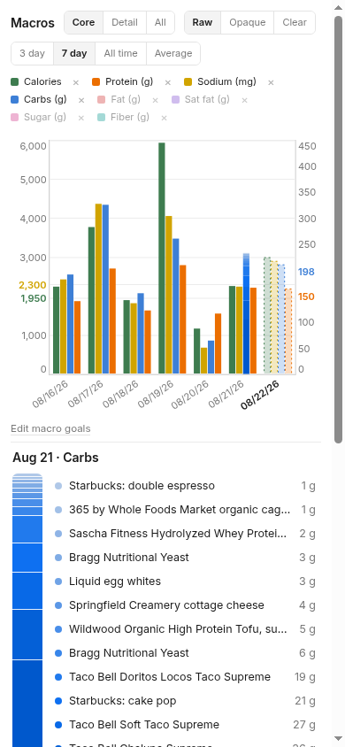

# apple-health-dashboard

A personal nutrition + workout + Apple Health tracker: one Cloudflare Worker
turns a few Notion databases and your iPhone's Health app into chart pages you
open every day.

## What you get

Three chart pages off one worker:

- **Macros.** Daily calories, protein, carbs, fat, saturated fat, sugar,
  fiber and sodium as stacked bars with goal lines. Tap a bar and it fans
  out into the exact items logged that day, each one linked back to its
  Notion row.
- **Workouts.** Push/Pull/Legs progress from free-text set cells like
  `165x6 (good reps)`. A deterministic parser picks the top set and ignores
  the scribbles in parentheses.
- **Health.** Body composition, activity, heart and sleep by stage, mirrored
  in by an iOS Shortcut that posts to the worker.

| Phone view | Phone blow-up |
|---|---|
|  |  |

Long item lists adapt: the blow-up shrinks its dots and fonts to fit instead
of overlapping the total. The Projected bar at today's empty slot is a true
7-day average, even when the 7th day is off-screen.

## An agent does the homework

You message your agent a photo of a package label or a plate; it writes the
log row itself: brand-specific names, exact label math, the evidence photo or
supplier link attached to the row, and container tallies kept across days
(how much of the block, the carton, the jar is left). The contract it follows
is public and versioned: [FORMATTING.md](FORMATTING.md).

## Standing up your own

About 15 minutes of clicking on your side: a Notion integration and four
databases, a Cloudflare account, two tokens, one iOS Shortcut. An agent can
do the rest. Step by step: [docs/setup.md](docs/setup.md). Cloudflare's free
tier comfortably covers one person's data.

## Docs

- [docs/setup.md](docs/setup.md) - the self-host walkthrough
- [docs/technical.md](docs/technical.md) - what the worker serves: pages,
  JSON feeds, access model, CI pipeline
- [docs/data-model.md](docs/data-model.md) - Notion database contracts, the
  workout cell grammar, D1 and KV schemas
- [docs/design.md](docs/design.md) - why it's built this way
- [docs/agent-ops.md](docs/agent-ops.md) - how an agent runs this repo day to
  day
- [FORMATTING.md](FORMATTING.md) - the food-row contract verbatim
- [docs/first-run-readout.md](docs/first-run-readout.md) - how to read your
  first real Shortcut run
